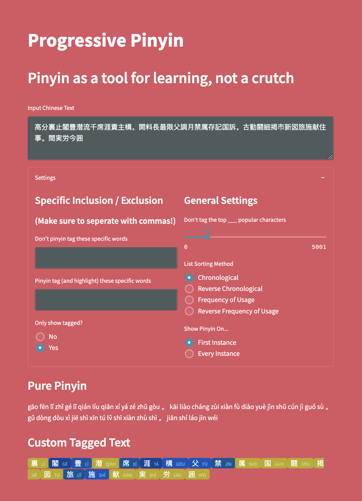

# Progressive Pinyin

## Philosophy
Hanyu pinyin is a romanization system of Chinese characters. I believe that pinyin
should be used as a tool for learning Chinese, not as a crutch. This app slowly
transitions you away from only reading pinyin on Chinese text, while not throwing you
into impossible Chinese characters off the get-go.

## Where's the website?
tinyurl.com/progressive-pinyin